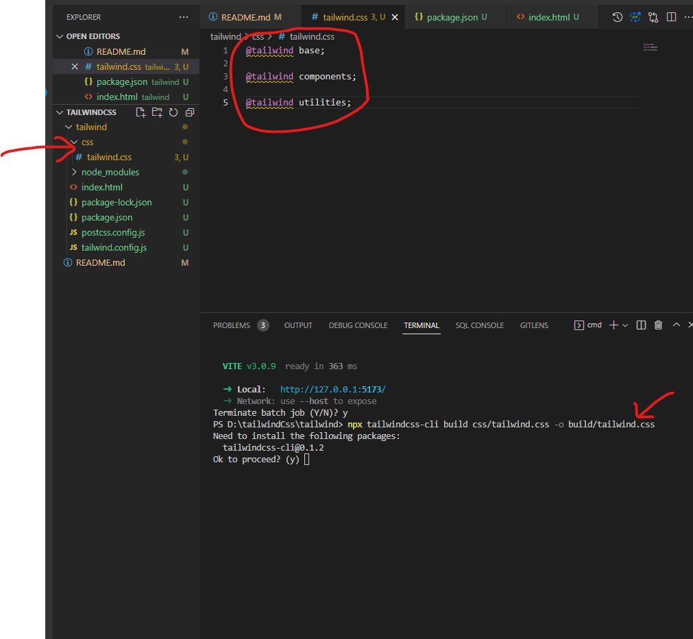

# tailwindCss
## 1: Setup tailwind
-   Phải cài node.js trên máy
Trang Chủ : https://tailwindcss.com/docs/installation

-   Tạo thư mục tailwind trong thư mục tạo file index.htlm
```Dockerfile
<!DOCTYPE html>
<html lang="en">
<head>
    <meta charset="UTF-8">
    <meta http-equiv="X-UA-Compatible" content="IE=edge">
    <meta name="viewport" content="width=device-width, initial-scale=1.0">
    <title>Document</title>
</head>
<body>
    
</body>
</html>
```
-   Mở terminal ở thư mục tailwind
```Dockerfile
npm install -g
npm init -y
npm install -D tailwindcss postcss autoprefixer vite
npx tailwindcss init -p
```
-   Vào package.json
```Dockerfile
"scripts": {
    "dev": "echo \"Error: no test specified\" && exit 1"
  },
```
-   Thay thế bằng:
```Dockerfile
"scripts": {
    "dev": "vite"
  },
```
-   Vào terminal chạy:
```Dockerfile
npm run dev
```
-  tạo thư mục như hình dưới và thêm nội dung 

```Dockerfile
@tailwind base;

@tailwind components;

@tailwind utilities;
```
Chạy lệnh 
```Dockerfile
npx tailwindcss-cli build css/tailwind.css -o build/tailwind.css  
``` 



-   Vào file index.html

```Dockerfile
<!DOCTYPE html>
<html lang="en">
<head>
    <meta charset="UTF-8">
    <meta http-equiv="X-UA-Compatible" content="IE=edge">
    <meta name="viewport" content="width=device-width, initial-scale=1.0">
    <title>Document</title>
</head>
<body>
    <div class="flex"> sầd</div>
</body>
</html>
```
-Chạy lại project 
```Dockerfile
npm run dev
```
-   Check lại ngoài trình duyệt và chúng ta đã hoàn thành setup tailwind.
-   Cài Extention Tailwind CSS IntelliSense trên vysual code
## 2:
- hình ảnh : https://unsplash.com/ 
- spacing : https://tailwindcss.com/docs/customizing-spacing
=> mỗi lầm sửa trong tailwind.config.js chúng ta cần build lại bằng lệnh
```Dockerfile
npx tailwindcss-cli build css/tailwind.css -o build/tailwind.css  
``` 
==> đọc thêm về tailwind 
https://tailwindcss.com/docs/customizing-spacing


```Dockerfile

```
